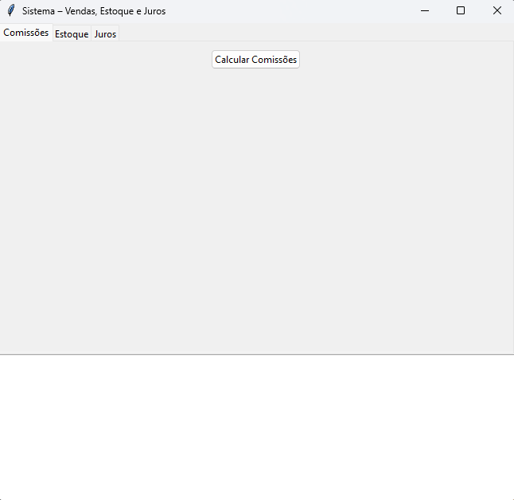
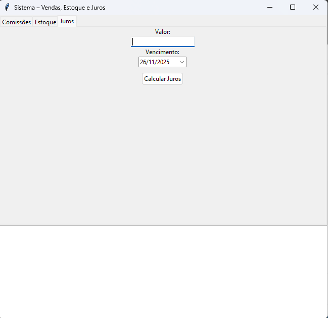
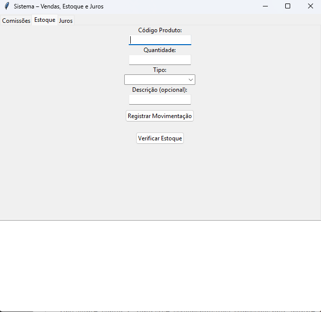

# 📘 Sistema Comercial - Desafio Técnico

Aplicação desktop desenvolvida em **Python** com interface gráfica utilizando **Tkinter** e **ttk**, atendendo todos os requisitos do desafio técnico proposto.


## ✨ Funcionalidades Implementadas

| Funcionalidade                  | Status |
|----------------------------------------|--------|
| Cálculo de Comissões por faixa de vendas | ✅     |
| Cálculo de Juros com seletor de data   | ✅     |
| Controle de Estoque                     | ✅     |
| Interface gráfica moderna (ttk)        | ✅     |
| Código modularizado e organizado       | ✅     |
| Tratamento de erros e validações       | ✅     |

---

## 🖼️ Screenshots

<div align="center">
  
  
  
</div>

---

## 📂 Estrutura do Projeto

```bash
src/
│
├── ui/                     # Telas e componentes visuais
│   ├── janela_principal.py
│   ├── aba_comissoes.py
│   ├── aba_juros_view.py
│   └── aba_estoque_view.py
│
├── services/               # Lógica de negócio
│   ├── comissoes.py
│   ├── juros.py
│   └── estoque.py
│
├── data/                   # Dados de exemplo
│   ├── estoque.py
│   └── vendas.py
│
├── main.py                 # Ponto de entrada da aplicação
└── requirements.txt        # Dependências do projeto
```

## 🔹 Detalhes das Funcionalidades

### Cálculo de Comissão
- Lê vendas de um arquivo `vendas.json`
- Regras de comissão:
  - Vendas **< R$ 100,00** → 0%
  - Vendas **< R$ 500,00** → 5%
  - Vendas **> R$ 500,00** → 5%
- Exibe total de comissão por vendedor

### Cálculo de Juros
- Seletor de data com **tkcalendar.DateEntry**
- Cálculo automático ao alterar valor, taxa ou prazo
- Suporte a juros simples e compostos

### Controle de Estoque
- Cadastro, edição e remoção de produtos
- Atualização em tempo real da quantidade

---

## 🚀 Como Executar


#### Clone o repositório

```bash
git clone https://github.com/NaanArmaX/Desafio-Tecnico---Target.git
cd Desafio-Tecnico---Target
```

#### Instale as dependências

```bash
   pip install -r requirements.txt
    
```
Obs: Tkinter já vem embutido no Python padrão

#### Execute a aplicação

```bash
    Bashpython src/main.py
```

